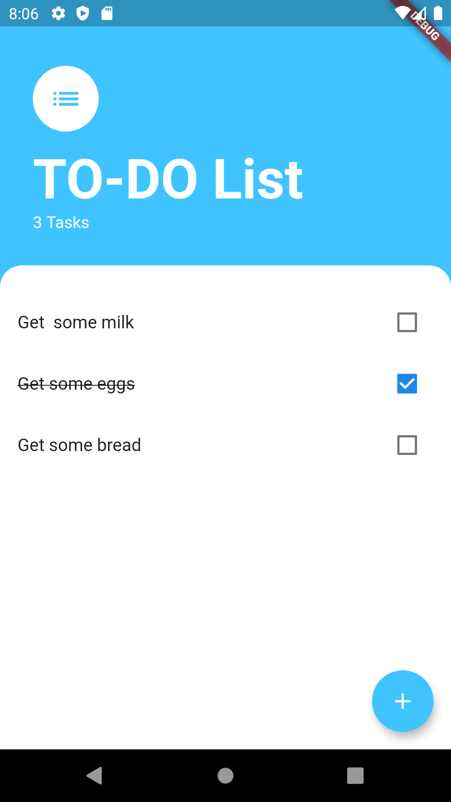

<h1>Todo - A simple offline TODO list app</h1>
I made this application by learning from a Udemy Course taught by <a href="https://github.com/angelabauer"> Angela Yu</a>. Thanks to her.
 

<h2> Screenshot -</h2> 

<b>Things I learned</b> 
- Providers and Consumer
- Lifting state up
- BottomSheet
- Callbacks
- ListView Builder

